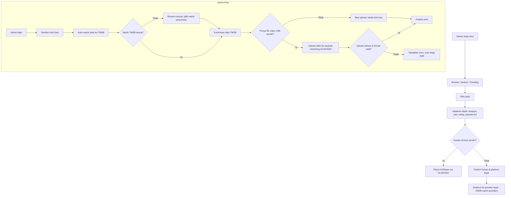

# PRD: Platform Katalog & Streaming Film/Series (Berbasis TMDB)

## Problem Statement
Belum ada platform yang menyatukan koleksi film/series yang dimiliki atau dilisensi secara pribadi ke dalam satu tampilan yang rapi dan familiar, setara pengalaman menonton di Netflix. Pemilik konten (hasil produksi sendiri, rekaman, atau konten berlisensi) selama ini hanya punya folder file biasa atau player generik tanpa metadata yang informatif. Dengan mengintegrasikan data TMDB (poster, sinopsis, cast, rating, daftar episode) ke dalam UI bergaya Netflix, publik bisa menjelajah dan menonton koleksi tersebut dengan pengalaman yang jauh lebih baik.

## Goals
1. Publik bisa browse, cari, dan menemukan film/series lewat kategori, trending, dan search dengan cepat.
2. Setiap judul dilengkapi metadata TMDB lengkap (poster, sinopsis, cast, rating; daftar season/episode untuk series).
3. Admin bisa menambah & mempublikasikan konten baru lewat alur simpel, dengan matching ke TMDB otomatis + review manual.
4. Konten yang dimiliki/dilisensi sendiri bisa diputar langsung di web lewat adaptive streaming (HLS/DASH) dengan player estetis (ArtPlayer).
5. Konten yang tidak dihost sendiri diarahkan ke platform legal via data TMDB watch-providers, sehingga situs tetap sepenuhnya legal.

## Non-Goals
- **Tidak** menghost atau mendistribusikan film/series berhak cipta yang bukan milik/lisensi admin — untuk konten tersebut situs murni katalog info + link keluar ke platform legal.
- Tidak menyediakan upload oleh sembarang user (UGC) — hanya admin yang bisa menambah konten, demi menjaga legalitas.
- Tidak membangun aplikasi mobile native di versi awal — fokus web responsive (desktop & mobile browser) dulu.
- Tidak membangun sistem akun/login untuk viewer publik di versi awal — watchlist versi awal disimpan local ke browser, bukan lintas device.

## Pendekatan Solusi
Arsitektur hybrid: TMDB API sebagai sumber metadata (poster, sinopsis, cast, rating, episode), dikombinasikan dengan katalog internal yang menyimpan status tiap judul (dihost sendiri atau link-only). Komponen utama: (1) frontend web responsive untuk browse, search, detail, dan player; (2) backend/API internal yang mengelola entri katalog, matching ke TMDB, dan otentikasi admin; (3) layanan streaming pihak ketiga (HLS/DASH) sebagai tempat hosting video milik/lisensi sendiri, supaya server utama tetap ringan tanpa perlu urus transcoding sendiri; (4) ArtPlayer sebagai video player client-side untuk pengalaman nonton yang estetis dan mendukung pilihan kualitas.

Video milik/lisensi sendiri sengaja tidak disimpan di server utama — di-embed lewat API streaming eksternal supaya kompleksitas transcoding, adaptive bitrate, dan bandwidth tidak membebani infrastruktur utama, konsisten dengan skala awal yang masih kecil/terbatas. Untuk konten yang bukan milik/lisensi sendiri, situs sengaja tidak menyimpan atau meng-embed video apa pun — hanya menampilkan info katalog dan mengarahkan viewer ke penyedia legal lewat data watch-providers TMDB. Pendekatan ini menjaga situs tetap dalam batas legal sambil tetap memberi pengalaman discovery yang lengkap.

## User Flow

**Viewer (publik, tanpa login):** buka situs → browse/search/trending → pilih judul → halaman detail (sinopsis, cast, rating, episode list bila series) → kalau konten dihost sendiri, muter langsung di player; kalau bukan, tombol "Tonton di [platform legal]" mengarah keluar.

**Admin (login terpisah):** login → tambah entri baru → sistem auto-match judul ke TMDB (review manual kalau match salah) → kalau punya file video milik sendiri, upload ke layanan streaming (HLS/DASH); kalau tidak, skip upload dan tandai sebagai link-only → publish. Entri yang belum lengkap (tanpa video & tanpa link legal valid) tetap berstatus draft, tidak tampil ke publik.



## Requirements

### P0 — Must Have
1. **Browse & Discover**
   - [ ] Given viewer buka homepage, When halaman dimuat, Then tampil trending & kategori dari data TMDB
   - [ ] Given viewer ketik keyword di search, When submit, Then muncul hasil film/series relevan
2. **Halaman Detail Film/Series**
   - [ ] Given viewer klik satu judul, When halaman detail dimuat, Then tampil poster, sinopsis, cast, rating dari TMDB
   - [ ] Given judul adalah series, When halaman detail dimuat, Then tampil daftar season & episode dari TMDB
3. **Admin Panel — Tambah/Edit/Hapus Entri**
   - [ ] Given admin login dengan kredensial valid, When akses panel admin, Then panel terbuka (non-admin ditolak)
   - [ ] Given admin input judul baru, When sistem auto-match ke TMDB, Then metadata terisi otomatis dan admin bisa koreksi manual
4. **Upload & Play Video (konten milik sendiri)**
   - [ ] Given admin upload video untuk entri yang dimiliki, When upload sukses & format valid, Then video tersedia diputar via ArtPlayer (HLS/DASH)
   - [ ] Given upload gagal atau format tidak didukung, When admin submit, Then sistem tampilkan error dan entri tetap draft
5. **Link ke Platform Legal**
   - [ ] Given entri tidak punya video ter-host, When viewer buka halaman detail, Then tombol "Tonton di [platform]" muncul, mengarah ke provider legal via TMDB watch-providers
6. **Status Draft/Publish**
   - [ ] Given entri belum lengkap (tanpa video & tanpa link legal), When disimpan, Then entri berstatus draft dan tidak tampil ke publik

### P1 — Should Have
1. **Watchlist/simpan favorit** — Given viewer klik "simpan" pada judul, When aksi berhasil, Then judul tersimpan di watchlist (browser-local)
2. **Rekomendasi personalisasi** — Given viewer sudah browsing beberapa judul, When buka homepage, Then muncul rekomendasi terkait
3. **Filter lanjutan** — Given viewer di halaman browse, When pilih filter genre/tahun/rating, Then hasil ter-filter sesuai pilihan

### P2 — Could Have
1. **Continue watching** — Given viewer berhenti nonton di tengah, When kembali ke situs, Then muncul opsi lanjut dari posisi terakhir
2. **Pilihan subtitle/bahasa** — Given video punya lebih dari satu subtitle, When buka player, Then bisa pilih bahasa subtitle

### Non-Fungsional
- **Performa:** lazy-load poster, cache respons TMDB, CDN untuk asset statis
- **Keamanan:** auth admin terpisah dari viewer, validasi format & ukuran file saat upload, rate-limit endpoint upload
- **Skalabilitas:** skala awal kecil/terbatas cukup dengan single server; beban video didelegasikan ke layanan streaming eksternal (HLS/DASH) supaya server utama tetap ringan

## Data & Integrasi
- **TMDB API:** trending, discover (movie/tv), search/multi, detail movie/tv, `tv/{id}/season/{season_number}` (episode list), `movie/{id}/watch/providers`, `tv/{id}/watch/providers`
- **Layanan streaming video (HLS/DASH):** vendor belum ditentukan — lihat Open Questions
- **Player:** ArtPlayer (client-side library)
- **Auth admin:** sistem login terpisah dari viewer — detail teknis (session/JWT) belum ditentukan

## Success Metrics
- **Leading:** jumlah pengunjung/browsing aktif harian (unique visitor ke halaman browse & detail)
- **Lagging:** retention — persentase viewer yang kembali dalam 7/30 hari

## Open Questions
- Nama produk/brand belum ditentukan
- Vendor layanan streaming HLS/DASH belum dipilih
- Perlu sistem akun viewer untuk watchlist lintas device, atau cukup browser-local di versi awal?
- Detail auth admin — single admin atau multi-admin dengan role berbeda?
- Target angka spesifik untuk metric pengunjung/retention belum ditetapkan

## Timeline
Belum ada deadline pasti. Rekomendasi: jalankan P0 sebagai MVP dulu, lanjut ke P1, baru P2 — tanpa target tanggal kaku sampai ditentukan lebih lanjut.

---

```yaml
agent_summary:
  problem: "Belum ada platform terpusat untuk menonton koleksi film/series milik/lisensi sendiri dengan pengalaman browsing setara Netflix, dilengkapi metadata dari TMDB."
  must_have:
    - "Browse/discover & search film/series pakai data TMDB (trending, kategori, search)"
    - "Halaman detail dengan metadata TMDB (sinopsis, cast, rating, episode list untuk series)"
    - "Admin panel: tambah/edit/hapus entri, auto-match ke TMDB by judul + review manual"
    - "Upload & play video (ArtPlayer, HLS/DASH) khusus konten yang dimiliki/dilisensi admin"
    - "Link 'Tonton di platform legal' via TMDB watch-providers untuk konten yang tidak dihost"
    - "Status draft/publish per entri"
  nice_to_have:
    - "Watchlist/simpan favorit"
    - "Rekomendasi personalisasi"
    - "Filter lanjutan (genre, tahun, rating)"
    - "Continue watching"
    - "Pilihan subtitle/bahasa"
  data_entities:
    - "TMDB metadata (movie, tv, season, episode, watch-providers)"
    - "Entri katalog internal (judul, tmdb_id, status draft/publish, video_url/embed_id)"
    - "Admin user (kredensial login)"
  success_metric: "Jumlah pengunjung/browsing aktif harian dan retention (viewer balik dalam 7/30 hari)"
  open_questions:
    - "Nama produk/brand"
    - "Vendor layanan streaming HLS/DASH"
    - "Sistem akun viewer untuk watchlist lintas device"
    - "Detail auth admin (single vs multi-admin)"
    - "Target angka spesifik retention/pengunjung"
  constraint_notes: "Scope streaming dibatasi hanya konten yang dimiliki/dilisensi admin sendiri; konten pihak ketiga yang tidak dimiliki hanya ditampilkan sebagai katalog info + link ke platform legal (tidak di-embed dari provider streaming tanpa lisensi)."
```
