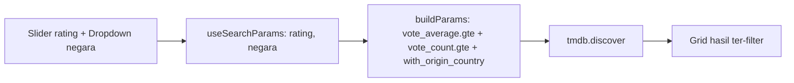

# Rancangan: Filter Lanjutan (Browse) — Rating Slider + Negara — P1

> **Status: DESIGN/REVIEW ONLY — BELUM DIIMPLEMENTASI.**
> Memenuhi PRD P1 #3: "Given viewer di halaman browse, When pilih filter genre/tahun/rating,
> Then hasil ter-filter sesuai pilihan." Browse sudah punya filter genre, tahun, urut. Yang
> belum ada (gap PRD) = filter **rating** sebagai batas (sekarang rating hanya urutan).
> Keputusan dari user: tambah **filter by country** + **rating slider**.
> Preview interaktif: `tmp-filter-preview.html` (root repo).

## 1. Ringkasan

Halaman Browse (`src/pages/Browse.jsx`) saat ini memfilter berdasarkan tipe (Film/Series),
genre (single), tahun (tunggal), dan urutan (populer/rating/terbaru) lewat `tmdb.discover`.
Fitur ini menambah dua filter baru:

1. **Rating minimum** — slider (`<input type="range">`, 0–10, step 0.5) dengan label nilai;
   mengirim `vote_average.gte` + `vote_count.gte` (ambang suara supaya rating bermakna).
2. **Negara asal** — dropdown daftar negara umum (hardcode ISO 3166-1); mengirim
   `with_origin_country`.

## 2. Keputusan desain (dari user)

| Aspek | Keputusan |
|---|---|
| Rating | **Slider minimum saja** (satu handle "Minimal rating"), mengirim `vote_average.gte`. Bukan rentang min–max. |
| Negara | **Daftar negara umum (hardcode)** — tanpa fetch daftar negara dari TMDB. |
| Lingkup | Hanya tambah rating + negara pada Browse yang sudah ada. Tidak mengubah genre/tahun/urut. |

## 3. Arsitektur

### 3.1 Modul baru — `src/lib/browseFilters.js` (plain, mudah dites)

```text
COUNTRIES: Array<{ code: string, name: string }>
//   daftar negara umum (ISO 3166-1): ID, US, KR, JP, GB, IN, CN, TH, PH, FR, DE, ...

ratingParam(min: string|number) -> { gte: number, countGte: number } | null
//   min <= 0 / kosong -> null (tanpa filter rating)
//   selain itu -> { gte: <min>, countGte: 100 }
```

### 3.2 Perubahan `src/pages/Browse.jsx`

- State baru dari URL (konsisten dengan genre/tahun/urut): `rating` (string) + `negara` (ISO code)
  via `useSearchParams`.
- `buildParams` diperluas:
  - bila `rating` → `vote_average.gte = rating`, `vote_count.gte = 100` (via `ratingParam`).
  - bila `negara` → `with_origin_country = negara`.
- UI `browse-bar`: tambah slider rating + dropdown negara di samping Tahun & Urutkan.
- Efek discover re-run saat `rating`/`negara` berubah (tambah ke dependency array).

### 3.3 Endpoint TMDB (terverifikasi via Context7, `discover/movie` & `discover/tv`)

- `vote_average.gte` — rating minimum. ✅
- `vote_count.gte` — ambang jumlah suara (dipakai agar rating tinggi tidak datang dari 1–2 vote). ✅
- `with_origin_country` — negara asal (ISO 3166-1). ✅

### 3.4 CSS

- Sedikit gaya untuk slider + bubble nilai di `src/styles/` (mengikuti gaya `browse-bar` existing).
- Slider memakai `<input type="range">` native (tanpa dependency).

## 4. Data flow



## 5. Error handling & edge cases

- Filter gagal → state `error` existing (pola sudah ada); tanpa penanganan baru.
- Kombinasi tanpa hasil → state kosong existing ("Tidak ada yang cocok").
- Slider `0` → tidak mengirim `vote_average.gte` (semua rating).
- Perubahan slider/dropdown mereset ke halaman 1 (pola `useEffect` existing yang reset `setPage(1)`).

## 6. Kriteria penerimaan

- [ ] Browse menampilkan slider "Minimal rating" (0–10, step 0.5) + label nilai saat ini.
- [ ] Menggeser slider memfilter hasil: hanya judul dengan `vote_average >= nilai` (dan `vote_count >= 100`) yang tampil.
- [ ] Browse menampilkan dropdown Negara dengan "Semua negara" + daftar hardcode.
- [ ] Memilih negara memfilter hasil ke `with_origin_country` tersebut (berlaku untuk Film & Series).
- [ ] Slider 0 / "Semua negara" tidak menambah parameter (hasil tidak ter-filter olehnya).
- [ ] Filter baru tercermin di URL (`?rating=..&negara=..`) dan bisa di-share/refresh.
- [ ] Filter baru bekerja bersama genre/tahun/urut yang sudah ada.
- [ ] `npm run build` lulus; smoke node untuk `ratingParam` jalan.

## 7. Non-goals (fase ini)

- **Bukan** slider rentang min–max (hanya minimum).
- **Bukan** multi-select genre atau rentang tahun.
- **Bukan** fetch daftar negara lengkap dari TMDB (`configuration/countries`).
- **Bukan** filter runtime/bahasa/watch-provider.
- **Bukan** mengubah Home/Watch/Detail/Search atau backend.

## 8. Implementasi (referensi, JANGAN dieksekusi di iterasi ini)

- Buat `src/lib/browseFilters.js` (`COUNTRIES` + `ratingParam`).
- Edit `src/pages/Browse.jsx`: state `rating`/`negara`, perluas `buildParams`, tambah UI slider + dropdown, perbarui dependency efek.
- Sedikit CSS untuk slider di `src/styles/`.
- Preview tata letak: `tmp-filter-preview.html`.
