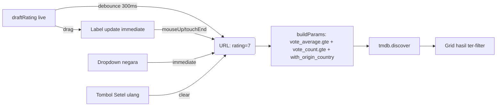

# Rancangan (Amended): Filter Lanjutan (Browse) — Rating Slider + Negara — P1

> **Status: DESIGN/REVIEW ONLY — BELUM DIIMPLEMENTASI.**
> Amended 2026-08-22: tambah debounce slider, vote_count collision fix, responsive, reset filter.
>
> Memenuhi PRD P1 #3: "Given viewer di halaman browse, When pilih filter genre/tahun/rating,
> Then hasil ter-filter sesuai pilihan." Browse sudah punya filter genre, tahun, urut. Yang
> belum ada (gap PRD) = filter **rating** sebagai batas (sekarang rating hanya urutan).
> Keputusan dari user: tambah **filter by country** + **rating slider**.

## 1. Ringkasan

Halaman Browse (`src/pages/Browse.jsx`) saat ini memfilter berdasarkan tipe (Film/Series),
genre (single), tahun (tunggal), dan urutan (populer/rating/terbaru) lewat `tmdb.discover`.
Fitur ini menambah dua filter baru:

1. **Rating minimum** — slider (`<input type="range">`, 0–10, step 0.5) dengan label nilai;
   mengirim `vote_average.gte` + `vote_count.gte` (ambang suara supaya rating bermakna).
2. **Negara asal** — dropdown daftar negara umum (hardcode ISO 3166-1); mengirim
   `with_origin_country`.

**Amendemen kritis:**
- **Debounce slider** — cegah 17 API call per drag (step 0.5 × 0→8)
- **`vote_count.gte` collision fix** — `Math.max` dengan sort-by-rating
- **Local `draftRating`** — label update live, URL debounced
- **Slider bubble** — visual feedback nilai
- **Tombol "Setel ulang"** — reset semua filter
- **Responsive** — slider width terbatas di bar

## 2. Keputusan desain (dari user)

| Aspek | Keputusan |
|---|---|
| Rating | **Slider minimum** (satu handle "Minimal rating"), `vote_average.gte`. Bukan rentang min–max. |
| Negara | **Daftar negara umum (hardcode)** — tanpa fetch daftar negara dari TMDB. |
| Lingkup | Hanya tambah rating + negara pada Browse yang sudah ada. Tidak mengubah genre/tahun/urut. |
| Debounce | **300ms** — cukup untuk cegah spam API tanpa noticeable delay. |
| Bubble slider | **Label teks `: X+` di samping slider** (ekonomis, tanpa custom positioning). |

## 3. Arsitektur

### 3.1 Modul baru — `src/lib/browseFilters.js` (plain, mudah dites)

```text
COUNTRIES: Array<{ code: string, name: string }>
//   daftar negara umum (ISO 3166-1): ID, US, KR, JP, GB, IN, CN, TH, PH, FR, DE, ...

DEBOUNCE_MS: 300
//   penundaan sebelum menulis rating ke URL (slider anti-spam)

ratingParam(min: string|number, existingCountGte?: number) -> { gte, countGte } | null
//   min <= 0 / kosong -> null (tanpa filter rating)
//   selain itu -> { gte: <min>, countGte: Math.max(100, existingCountGte || 0) }
//   existingCountGte parameter opsional untuk mencegah override nilai dari sort-by-rating
```

### 3.2 Perubahan `src/pages/Browse.jsx`

#### 3.2.1 State

- `rating` (string) — dari URL, final value setelah debounce (~300ms setelah drag selesai)
- `draftRating` (string) — **local state** sinkron dengan posisi slider saat drag (update immediate)
- `negara` (string) — dari URL (tanpa debounce, karena dropdown)

State live untuk label slider:

```js
const rating = sp.get('rating') || ''
const [draftRating, setDraftRating] = useState(rating)  // <-- baru
const negara = sp.get('negara') || ''
```

**Sinkronisasi draftRating → rating (URL) — debounce 300ms:**

```js
useEffect(() => {
  const t = setTimeout(() => {
    const next = new URLSearchParams(sp)
    if (draftRating && draftRating !== '0') next.set('rating', draftRating)
    else next.delete('rating')
    setSp(next, { replace: true })  // replace agar tidak flood history
  }, 300)
  return () => clearTimeout(t)
  // eslint-disable-next-line react-hooks/exhaustive-deps
}, [draftRating])
```

> Mengapa tidak langsung `setParam`? Karena setiap `setSp` memicu re-render + re-run discover
> effect. Debounce cegah 17 API call per drag.

#### 3.2.2 buildParams diperluas

```js
const buildParams = (p) => {
  const out = { page: p }
  out.sort_by = /* existing */
  if (genre) out.with_genres = genre
  if (tahun) out[/* existing */] = tahun
  if (urut === 'rating') out['vote_count.gte'] = '200'

  const rp = ratingParam(rating, Number(out['vote_count.gte']))
  //                        ^^^^^^^^^^^^^^^^^^^^^^^^^^^^^^^^
  //   Baru: passing existing vote_count.gte agar Math.max tidak override sort threshold
  if (rp) {
    out['vote_average.gte'] = String(rp.gte)
    out['vote_count.gte'] = String(rp.countGte)  // sudah Math.max dengan 200 bila urut=rating
  }

  if (negara) out.with_origin_country = negara
  return out
}
```

#### 3.2.3 Dependency efek discover

```js
// eslint-disable-next-line react-hooks/exhaustive-deps
}, [tipe, genre, tahun, urut, rating, negara])
//                          ^^^^^^  ^^^^^^  baru: auto-reset page saat filter berubah
```

#### 3.2.4 UI

Di dalam `.browse-bar`, di samping label Tahun & Urutkan:

```jsx
<label className="filter-rating">
  Minimal rating{draftRating && Number(draftRating) > 0 ? ` : ${draftRating}+` : ''}
  <input
    type="range" min="0" max="10" step="0.5"
    className="field-range"
    value={draftRating || 0}
    onChange={(e) => setDraftRating(e.target.value)}
    onMouseUp={() => {/* force immediate commit on release */}}
    onTouchEnd={() => {/* same for mobile */}}
    aria-label="Rating minimum"
    aria-valuenow={draftRating || 0}
    aria-valuemin={0}
    aria-valuemax={10}
  />
</label>
<label>
  Negara
  <select
    className="field"
    value={negara}
    onChange={(e) => setParam('negara', e.target.value)}
  >
    <option value="">Semua negara</option>
    {COUNTRIES.map((c) => (
      <option key={c.code} value={c.code}>{c.name}</option>
    ))}
  </select>
</label>
```

**Catatan `onMouseUp`/`onTouchEnd`:** Selain debounce 300ms, commit paksa saat user lepas
slider — memastikan hasil terbaru segera tampil tanpa menunggu timer.

#### 3.2.5 Tombol "Setel ulang"

Tombol kecil di pojok browse-bar, visible hanya saat **ada filter aktif**:

```jsx
{(rating || negara || genre || tahun || urut !== 'populer') && (
  <button className="btn-reset" onClick={() => { setSp(new URLSearchParams()); setDraftRating('') }}>
    Setel ulang
  </button>
)}
```

Membersihkan semua search params → kembali ke discover default.

### 3.3 Endpoint TMDB (terverifikasi via Context7, `discover/movie` & `discover/tv`)

- `vote_average.gte` — rating minimum. ✅
- `vote_count.gte` — ambang jumlah suara (dipakai agar rating tinggi tidak datang dari 1–2 vote). ✅
- `with_origin_country` — negara asal (ISO 3166-1). ✅

### 3.4 CSS

Gaya untuk slider + bubble nilai + reset button — ditambahkan ke `src/styles/pages.css` (mengikuti gaya `browse-bar` existing).

```css
/* Slider rating */
.browse-bar label.filter-rating {
  display: inline-flex;
  align-items: center;
  gap: 6px;
  max-width: 240px;  /* batasi lebar slider agar tidak stretch */
}
.field-range {
  width: 120px;
  accent-color: var(--clr-accent);
  cursor: pointer;
}
/* Tombol reset */
.btn-reset {
  padding: 4px 12px;
  font-size: 0.85rem;
  border-radius: 6px;
  border: 1px solid var(--clr-border);
  background: transparent;
  cursor: pointer;
  white-space: nowrap;
}
.btn-reset:hover { background: var(--clr-surface-hover); }
```

`.browse-bar` sudah `flex-wrap: wrap`, jadi filter baru akan wrap ke baris kedua saat layar
sempit. `max-width: 240px` pada `.filter-rating` mencegah slider merenggang di baris sendiri.

### 3.5 Responsive behavior

| Lebar layar | Tata letak browse-bar |
|---|---|
| ≥900px | Semua filter inline (tabs + spacer + tahun + urut + rating + negara + reset) |
| 600–899px | Rating + negara turun ke baris 2, reset tetap inline |
| <600px | Setiap filter baris sendiri (flex-wrap alami) |

Tidak perlu media query khusus — `flex-wrap: wrap` + `max-width` sudah mencukupi.

## 4. Data flow



## 5. Error handling & edge cases

- Filter gagal → state `error` existing (pola sudah ada); tanpa penanganan baru.
- Kombinasi tanpa hasil → state kosong existing ("Tidak ada yang cocok").
- **Debounce race condition:** Jika user drag slider cepat dan komponen unmount sebelum
  timer selesai → `clearTimeout` di cleanup mencegah `setSp` pada komponen unmounted. ✅
- **Local state stale:** `draftRating` diinisialisasi dari `rating` URL saat mount, tapi
  tidak sync ulang saat `setParam` langsung (misal dari reset). Solusi: reset `setDraftRating('')` di onClick reset.
- Slider `0` → tidak mengirim `vote_average.gte` (semua rating).
- Perubahan slider/dropdown mereset ke halaman 1 (pola `useEffect` existing yang reset `setPage(1)`).

## 6. Kriteria penerimaan

- [ ] Browse menampilkan slider "Minimal rating" (0–10, step 0.5) + label nilai **live saat drag**.
- [ ] Menggeser slider memfilter hasil: hanya judul dengan `vote_average >= nilai` (dan `vote_count >= 100`) yang tampil.
- [ ] **Debounce 300ms:** drag cepat dari 0→8 hanya memicu ~2–3 API call (bukan 17).
- [ ] **`vote_count.gte` collision:** saat filter rating aktif + urut=rating, threshold tetap `vote_count.gte=200`.
- [ ] Browse menampilkan dropdown Negara dengan "Semua negara" + daftar hardcode.
- [ ] Memilih negara memfilter hasil ke `with_origin_country` tersebut (berlaku untuk Film & Series).
- [ ] Slider 0 / "Semua negara" tidak menambah parameter (hasil tidak ter-filter olehnya).
- [ ] Filter baru tercermin di URL (`?rating=..&negara=..`) dan bisa di-share/refresh.
- [ ] Filter baru bekerja bersama genre/tahun/urut yang sudah ada.
- [ ] **Tombol "Setel ulang"** tampil hanya saat ada filter aktif, dan mereset semua state.
- [ ] **Responsive:** slider tidak overflow di layar sempit (<600px).
- [ ] `npm run build` lulus; smoke node untuk `ratingParam` + `DEBOUNCE_MS` jalan.
- [ ] **Dead import `keyOf`** dibersihkan dari `src/pages/Browse.jsx` (import tapi tidak dipakai).

## 7. Non-goals (fase ini)

- **Bukan** slider rentang min–max (hanya minimum).
- **Bukan** multi-select genre atau rentang tahun.
- **Bukan** fetch daftar negara lengkap dari TMDB (`configuration/countries`).
- **Bukan** filter runtime/bahasa/watch-provider.
- **Bukan** mengubah Home/Watch/Detail/Search atau backend.

## 8. Implementasi (referensi, JANGAN dieksekusi di iterasi ini)

- Buat `src/lib/browseFilters.js` (`COUNTRIES` + `DEBOUNCE_MS` + `ratingParam`).
- Edit `src/pages/Browse.jsx`: state `rating`/`draftRating`/`negara`, debounce effect, perluas
  `buildParams` + dependency array, tambah UI slider + dropdown + reset button.
- CSS untuk `.field-range` + `.btn-reset` + `.filter-rating` di `src/styles/pages.css`.
- Bersihkan `import { keyOf }` yang tidak dipakai.
- Preview tata letak: `tmp-filter-preview.html`.