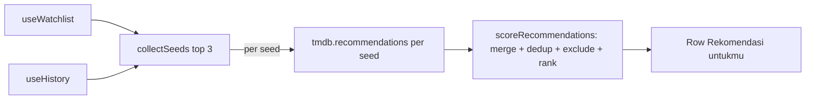

# Rancangan: Rekomendasi Personalisasi (Home) — P1

> **Status: DESIGN/REVIEW ONLY — BELUM DIIMPLEMENTASI.**
> Memenuhi PRD P1 #2: "Given viewer sudah browsing beberapa judul, When buka homepage,
> Then muncul rekomendasi terkait." Keputusan pendekatan (dari user): **opsi A — multi-seed
> merge + scoring, client-side.**
> Preview interaktif: `tmp-reco-preview.html` (root repo).

## 1. Ringkasan

Saat ini `Home.jsx` hanya merekomendasikan dari **judul pertama di watchlist** (satu seed,
`tmdb.recommendations(watchlist[0])`). Fitur ini menggantinya dengan rekomendasi dari
**gabungan watchlist + history (continue watching)**: beberapa seed teratas dipilih, hasil
`tmdb.recommendations` per seed digabung, di-dedup, di-skor, lalu dirender sebagai satu baris
**"Rekomendasi untukmu"** di Home.

## 2. Keputusan desain (dari user)

| Aspek | Keputusan |
|---|---|
| Sumber seed | **Gabungan watchlist + history** (multi-seed, scoring) — bukan history-only atau watchlist-only. |
| Pendekatan | **Client-side murni** — memakai `tmdb.recommendations` + cache 5 menit yang sudah ada. Tanpa backend, tanpa dependency baru, tanpa ML. |
| Tampilan | **Satu Row** berjudul "Rekomendasi untukmu" (bukan satu row per seed). |
| Lingkup | Home saja. Tanpa mengubah Watch.jsx, lib lain, atau backend. |

## 3. Arsitektur

### 3.1 Modul baru — `src/lib/recommend.js` (plain functions, mudah dites)

Kontrak publik:

```text
collectSeeds(watchlist, history, n = 3) -> Seed[]
//   Seed = { type: 'movie'|'tv', id: number, title: string }
//   - gabungkan dua sumber; unik per `${type}:${id}`
//   - bobot: history (pernah diputar) > watchlist (hanya disimpan)
//   - tiebreak: lebih baru dulu (history.updatedAt / watchlist.addedAt)
//   - diversifikasi: jika n ≥ 2 dan semua seed bertipe sama,
//     coba ganti salah satu dengan kandidat tersisa dari tipe berbeda
//     (mencegah 3 film Marvel → rekomendasi homogen)
//   - kembalikan top n

scoreRecommendations(seedResults, excludeKeys, limit = 20) -> TmdbItem[]
//   seedResults = Array<{ seed, results }> (hasil recommendations per seed)
//   - skor item = jumlah seed yang merekomendasikannya
//                 + bobot kecil dari vote_average/10 (kualitas; TMDB range 0-10,
//                   dibagi 10 agar kontribusi skor maksimal 1, seimbang dengan "1 per seed")
//   - dedup by `${media_type|type}:${id}`
//   - buang item yang sudah ada di watchlist/history (excludeKeys: Set of `${type}:${id}`)
//   - filter item tanpa poster_path
//   - urutkan skor desc -> top `limit`
```

Kedua fungsi murni (tanpa side effect) sehingga bisa diverifikasi dengan smoke node.

### 3.2 Perubahan `src/pages/Home.jsx`

- Ganti efek rekomendasi watchlist-saja dengan efek yang:
  1. membaca `useWatchlist()` + `useHistory()`;
  2. `collectSeeds(watchlist, history, 3)`;
  3. bila kosong → `setPicks(null)`, `setPicksLoading(false)`;
  4. `setPicksLoading(true)` sebelum fetch;
  5. `Promise.allSettled` panggil `tmdb.recommendations(seed.type, seed.id)` per seed (mengikuti pola `ok()` yang sudah ada);
  6. `scoreRecommendations(...)` dengan `excludeKeys` dari gabungan watchlist+history;
  7. jika hasil rekomendasi kosong/seed gagal semua → **fallback ke trending** (`rows.trendW`) sebagai isi baris dengan judul "Sedang Tren";
  8. `setPicks(items)`, `setPicksLoading(false)`.
- State: tambah `picksLoading` (boolean) untuk kontrol skeleton.
- Render:
  - Saat `picksLoading` → `<RowSkeleton />` (cegah layout jump).
  - Saat `picks` terisi → `<Row kicker="Dipersonalisasi" title="Rekomendasi untukmu" items={picks} />`.
  - Posisi: setelah `<ContinueRow />`. Aman karena `ContinueRow` return `null` bila history kosong — tidak ada gap DOM.
- Catatan fallback: baris tetap tampil (judul berubah jadi "Sedang Tren") agar section tidak kosong di mata pengguna yang sudah punya seed.

### 3.3 Tidak berubah

- `src/components/Row.jsx`, `PosterCard`, `ContinueRow` — dipakai ulang apa adanya.
- `src/lib/tmdb.js` — `tmdb.recommendations` + cache sudah ada; tanpa perubahan.
- `src/lib/watchlist.js`, `src/lib/history.js` — hanya dibaca (hooks `useWatchlist`, `useHistory`).
- Backend (`server/`) — tidak disentuh.

### 3.4 Loading skeleton

Efek baru memanggil 3 API TMDB secara paralel (`Promise.allSettled`). Ada jeda yang kasat mata — perlu skeleton agar layout tidak jump.

- Tambah state `picksLoading` (default `false`).
- `picksLoading = true` sebelum `Promise.allSettled`, `false` setelah selesai.
- Saat `picksLoading` dan seeds tersedia → render `<RowSkeleton />` di posisi yang sama dengan Row rekomendasi (menggunakan komponen `RowSkeleton` yang sudah ada di `src/components/Skeletons.jsx`).
- Saat `picksLoading = false` dan `picks = null` → skeleton hilang, Row tidak dirender.

## 4. Data flow



## 5. Error handling & edge cases

- Tiap seed dipanggil via `Promise.allSettled`; seed yang gagal diabaikan (pola `ok()` existing).
- Semua seed gagal / tanpa hasil → fallback ke trending (`rows.trendW`) sebagai isi baris dengan judul "Sedang Tren" — section tetap ditampilkan selama seeds ada, agar tidak kosong.
- Watchlist & history kosong → Row tidak dirender (pengalaman pengguna baru tidak berubah).
- Item rekomendasi yang sudah ada di watchlist/history dibuang (tidak menyarankan yang sudah dikenal).
- Item tanpa `poster_path` dibuang (konsisten dengan `clean()` di Home).

## 6. Kriteria penerimaan

- [ ] Home menampilkan satu Row "Rekomendasi untukmu" bila ada ≥1 seed (watchlist atau history).
- [ ] Seed berasal dari gabungan watchlist + history (maks 3, bobot history > watchlist).
- [ ] Seeds tidak homogen: bila ada campuran movie dan TV, seed terpilih mencakup kedua tipe.
- [ ] Hasil dari beberapa seed digabung, dedup by id, dan diurutkan (item yang direkomendasikan lebih banyak seed muncul lebih dulu).
- [ ] Skor rekomendasi: kontribusi `vote_average` maksimal 1.0 (bukan 0.8) — seimbang dengan bobot "1 per seed".
- [ ] Item yang sudah ada di watchlist/history tidak muncul di rekomendasi.
- [ ] Item tanpa poster tidak muncul.
- [ ] Loading skeleton tampil saat fetch 3 rekomendasi seed berlangsung — tidak ada layout jump.
- [ ] Semua seed gagal atau hasil kosong → fallback ke trending ("Sedang Tren"), bukan section kosong.
- [ ] Kegagalan satu seed tidak merusak baris.
- [ ] Pengguna baru (tanpa watchlist/history) tidak melihat baris rekomendasi.
- [ ] `npm run build` lulus; smoke node untuk `collectSeeds` & `scoreRecommendations` jalan.

## 7. Non-goals (fase ini)

- **Bukan** rekomendasi berbasis ML / collaborative filtering.
- **Bukan** multi-row per seed ("Karena kamu menonton X" per judul).
- **Bukan** endpoint backend baru.
- **Bukan** mengubah Watch/Detail/Search.

## 8. Implementasi (referensi, JANGAN dieksekusi di iterasi ini)

- Buat `src/lib/recommend.js` (collectSeeds + scoreRecommendations dengan seed diversity + score weight fix).
- Edit `src/pages/Home.jsx`: impor `useHistory` + dua fungsi baru; ganti efek rekomendasi;
  tambah state `picksLoading` + skeleton; ubah render (posisi setelah ContinueRow, skeleton saat loading,
  fallback trending saat hasil kosong).
- Preview tata letak: `tmp-reco-preview.html`.
